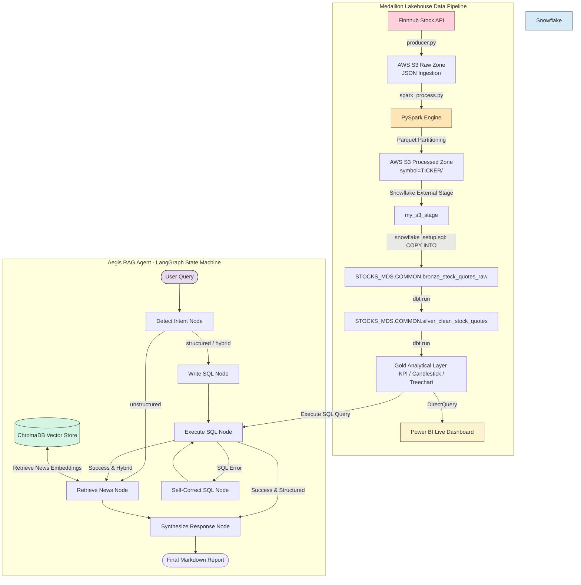
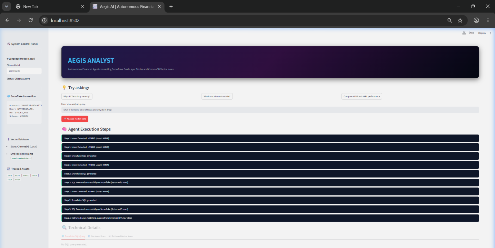
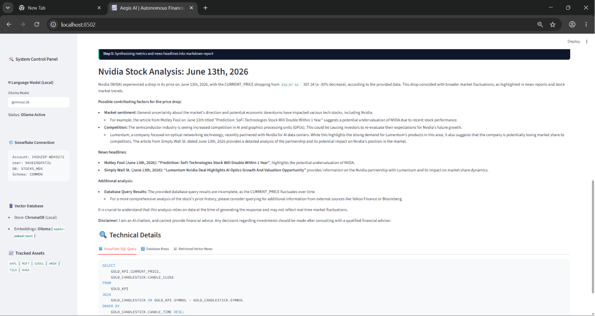
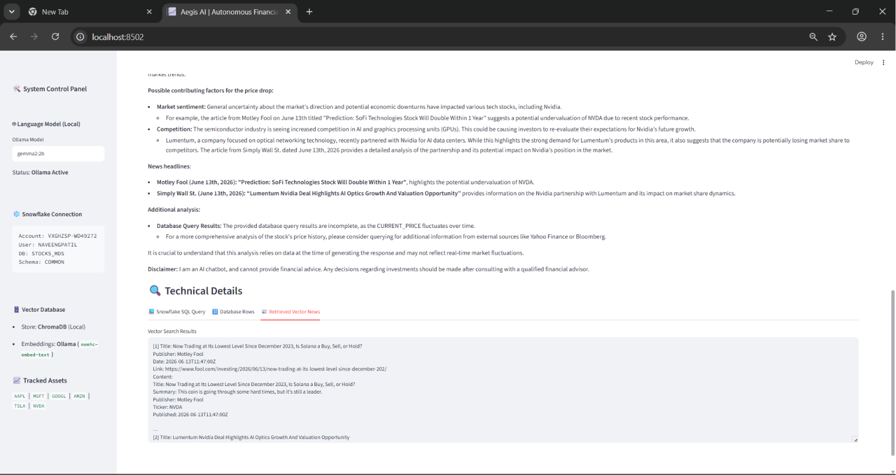
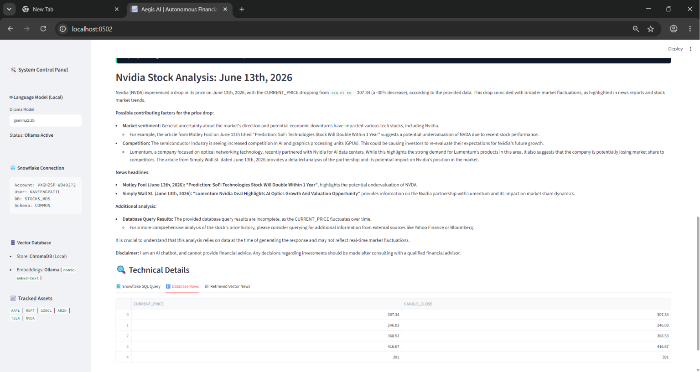

# 📈 Real-Time Stock Market Data Lakehouse & Aegis AI Analyst

[](https://www.python.org/)
[](https://ollama.com/)
[](https://github.com/langchain-ai/langgraph)
[](https://www.trychroma.com/)
[](https://spark.apache.org/)
[](https://aws.amazon.com/s3/)
[](https://www.snowflake.com/)
[](https://www.getdbt.com/)
[](https://www.docker.com/)
[](https://kubernetes.io/)
[](https://www.terraform.io/)

An end-to-end, production-ready **Real-Time Stock Market Data Platform** that pairs a **Medallion Data Lakehouse Pipeline** (data engineering) with **Aegis Analyst**, an autonomous **AI RAG Agent** (AI engineering) powered by local LLMs, vector search, and self-correcting SQL execution.

---

## 📌 System Architecture

The platform consists of two primary operational systems:
1. **Medallion Data Pipeline**: Live Finnhub data stream $\rightarrow$ S3 Raw (JSON) $\rightarrow$ PySpark Engine $\rightarrow$ S3 Processed (Partitioned Parquet) $\rightarrow$ Snowflake COPY $\rightarrow$ dbt Transformations (Bronze/Silver/Gold) $\rightarrow$ Power BI Live.
2. **Aegis AI Agent**: LangGraph state machine $\rightarrow$ Intent Detection $\rightarrow$ Snowflake Gold-layer SQL querying (with compile-error self-correction) $\rightarrow$ ChromaDB vector news retrieval $\rightarrow$ LLM Synthesis via local Ollama.



---

## 🤖 Part 1: Aegis Analyst (Autonomous AI Agent)

**Aegis Analyst** is an autonomous agentic RAG app built using **LangGraph** and served via **Streamlit** 100% locally:
* **Intent Detection**: Leverages Ollama (`gemma2:2b`) to parse natural language queries, extract tickers (e.g. `TSLA`), and classify user intent (`structured`, `unstructured`, or `hybrid`).
* **Self-Correcting SQL Tool**: Auto-generates Snowflake SQL queries against the Gold Analytical schema. If a query fails (e.g. wrong columns or schema mismatch), a compilation loop feeds the error back to the LLM to correct the query.
* **Local Vector Store**: Queries a local **ChromaDB** index containing the latest financial news scraped from RSS feeds, generating embeddings locally via `nomic-embed-text`.
* **Hybrid Context Synthesis**: Blends raw database metrics (e.g. daily closed price, % change) with semantic news context (e.g. SpaceX's IPO shifting Musk's assets) to draft a citation-supported markdown report.

### 📸 Agent Interface & Technical Details

#### 1. Agent Execution Steps (Workflow Progress)
The step-by-step progress tracking of the LangGraph agent in the frontend UI.


#### 2. SQL Query Generation & Self-Correction
View the generated, executed raw SQL query and query response stats.


#### 3. ChromaDB Vector News Retrieval
View semantic article matches and similarity metrics fetched from the local vector database.


#### 4. Snowflake Database Rows (Quantitative View)
Tabular representation of historical stock metrics loaded from Snowflake Gold Layer.


---

## 🏗️ Part 2: Medallion Lakehouse Pipeline

A data-lakehouse pipeline built using Python and distributed computing to cleanse, transform, and aggregate raw stock data:
* **PySpark Processing**: Reads raw JSON tick data from S3, enforces static schemas, filters nulls, and writes optimized Parquet partitions back to S3 (`symbol=TICKER/`).
* **Snowflake Stages**: Bulk loads Parquet data using Snowflake external stages pointing to AWS S3.
* **dbt Transformations**: 
  * `Bronze`: Maps external raw stages to views.
  * `Silver`: Cleanses, deduplicates, and rounds raw quotes.
  * `Gold`: Computes analytics KPIs (`GOLD_KPI`), historical candlestick series (`GOLD_CANDLESTICK`), and stock volatility distributions (`GOLD_TREECHART`).
* **Power BI Dashboard**: Visualizes stock trends, volume metrics, and volatility.

### 📸 Lakehouse Data Artifacts

#### 1. Partitioned Processed Zone (AWS S3)


#### 2. Snowflake Ingestion Layer


#### 3. Power BI Live Dashboard


---

## 📂 Repository Structure

```text
real-time-stocks-pipeline/
├── producer/                     # Raw stock tick data ingestion script
│   └── producer.py               # Finnhub API client saving raw JSON to S3
├── dbt_stocks/                   # dbt transformation models
│   ├── models/                   # Medallion layers
│   │   ├── bronze/               # Bronze views mapping raw tables
│   │   ├── silver/               # Silver tables (deduplicated & rounded)
│   │   └── gold/                 # Gold analytical tables (KPIs, Candlesticks, Treecharts)
│   ├── dbt_project.yml           # dbt project configuration
│   └── profiles.yml              # dbt profile connection to Snowflake
├── k8s/                          # Kubernetes Manifests
│   ├── configmap.yaml            # Environment variables ConfigMap
│   ├── secrets.yaml              # Secret credentials template
│   ├── deployment.yaml           # App Deployment (with persistent vector volume)
│   └── service.yaml              # NodePort Service exposing application
├── terraform/                    # Reference AWS Infrastructure IaC
│   ├── main.tf & variables.tf    # Provider block and configuration variables
│   ├── vpc.tf                    # Custom AWS VPC setup (subnets, route tables, NAT)
│   ├── eks.tf                    # AWS EKS cluster and Managed Node Groups
│   └── outputs.tf                # Cluster endpoints and repository URLs
├── agent_brain.py                # LangGraph agent orchestration logic
├── app.py                        # Streamlit web application frontend
├── deploy_k8s.sh                 # Bash deployer script (automated base64 + apply)
├── deploy_k8s.ps1                # PowerShell deployer script
├── Dockerfile                    # Multi-stage optimized application container
├── ingest_news.py                # News scraping & ChromaDB vector ingestion
├── run_dbt.py                    # Helper wrapper to run dbt loading from .env
├── spark_process.py              # PySpark cleaning and Parquet partitioning script
├── snowflake_setup.sql           # Snowflake DDL, Stages, and COPY INTO queries
├── requirements-rag.txt          # Python dependencies for Agent application
└── requirements.txt              # Python dependencies for Spark/DBT pipeline
```

---

## 🚀 Running & Deploying the App

### Option A: Local Dev Mode (Streamlit + Virtual Env)
1. **Clone & Install Dependencies**:
   ```bash
   pip install -r requirements-rag.txt
   ```
2. **Setup Local LLM (Ollama)**:
   * Download [Ollama](https://ollama.com/download) and run:
     ```bash
     ollama pull gemma2:2b
     ollama pull nomic-embed-text
     ```
3. **Populate Vector Database**:
   ```bash
   python ingest_news.py
   ```
4. **Launch Application**:
   ```bash
   streamlit run app.py
   ```

### Option B: Standalone Docker Mode
1. **Configure Ollama for External Traffic**:
   Ollama must listen on all ports to accept requests from Docker:
   * Quit Ollama from your System Tray.
   * Open your terminal and run:
     * **Bash**: `export OLLAMA_HOST=0.0.0.0 && ollama serve`
     * **PowerShell**: `$env:OLLAMA_HOST="0.0.0.0" ; ollama serve`
2. **Run the Container**:
   Build the image and run it, mounting the news database and feeding credentials:
   ```bash
   docker build -t stocks-analyst:latest .
   docker run -d \
     -p 8502:8501 \
     -e OLLAMA_HOST=http://host.docker.internal:11434 \
     --add-host=host.docker.internal:host-gateway \
     --env-file .env \
     -v "$(pwd)/chroma_db:/app/chroma_db" \
     stocks-analyst:latest
   ```
3. Open **`http://localhost:8502`** in your browser.

### Option C: Kubernetes Local Deployment
1. Enable Kubernetes under **Docker Desktop Settings** $\rightarrow$ **Kubernetes** $\rightarrow$ **Enable Kubernetes**.
2. Run the automated deployment script (which handles secret formatting, builds the image, and deploys all configurations):
   * **In Git Bash**: `./deploy_k8s.sh`
   * **In PowerShell**: `./deploy_k8s.ps1`
3. Access the Kubernetes-hosted Streamlit app at **`http://localhost:30501`**.

### Option D: AWS Cloud EKS Infrastructure (Terraform IaC)
To deploy the infrastructure stack in AWS:
```bash
cd terraform
terraform init
terraform plan
terraform apply
```
This will automatically provision your VPC subnets, NAT gateway, EKS cluster (ready for `kubectl`), and your private ECR repository to push container builds.
