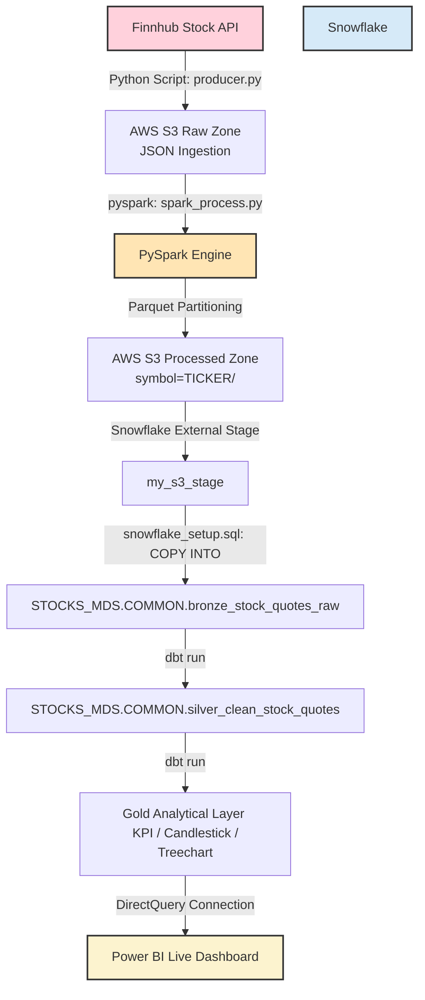
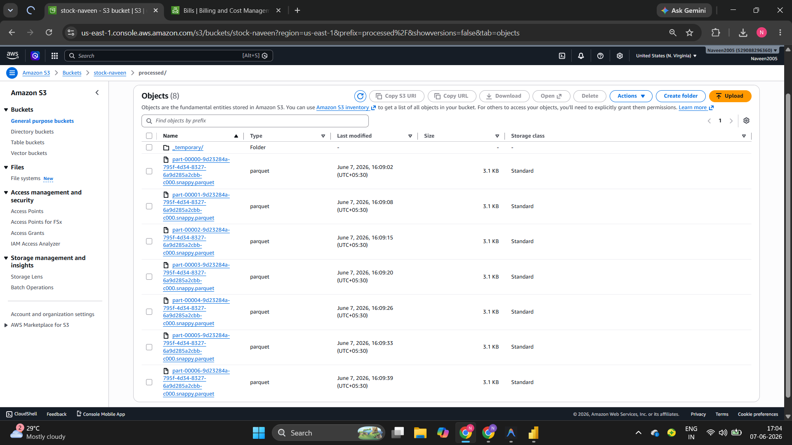
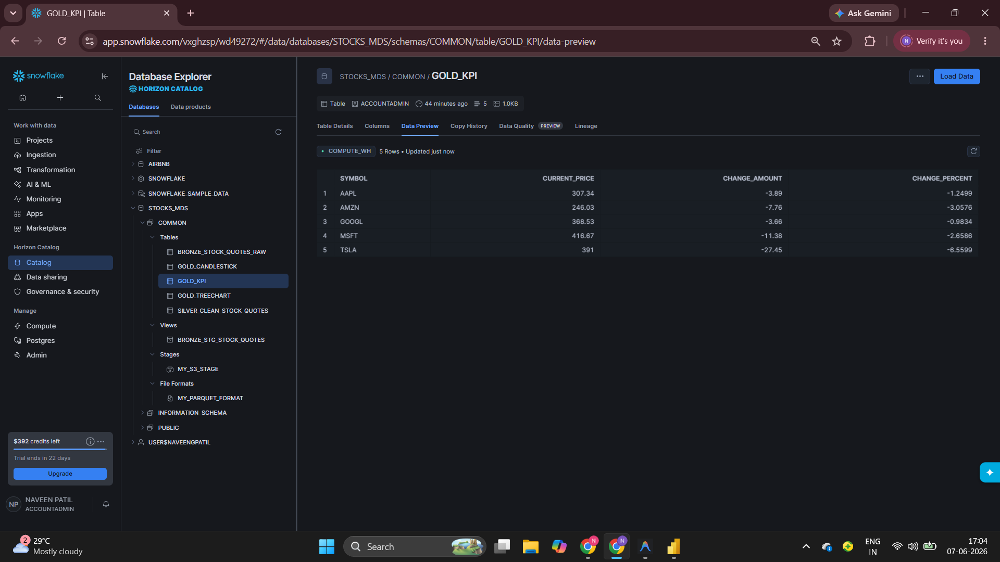
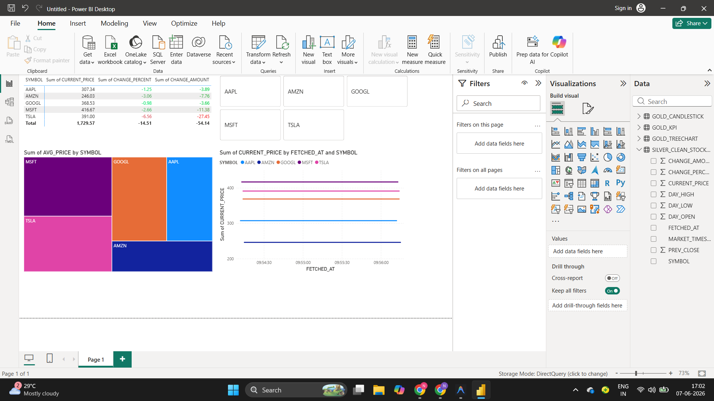
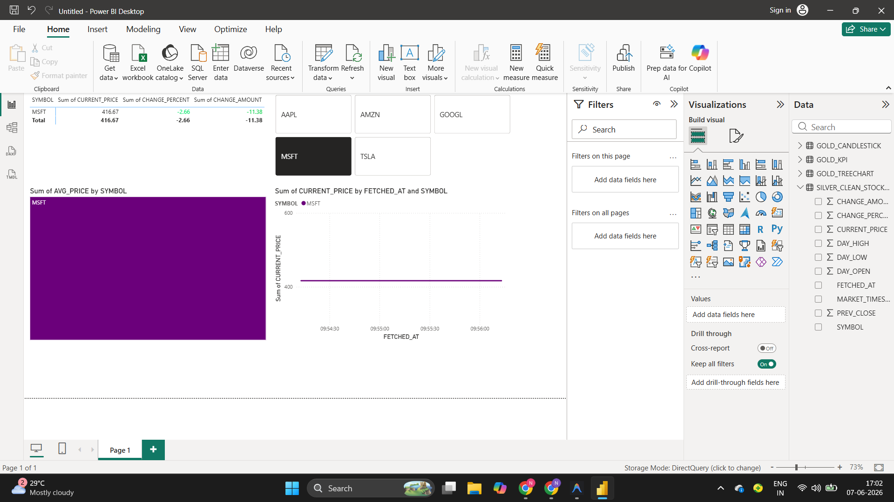

# 📈 Real-Time Stock Market Data Lakehouse Pipeline

[](https://www.python.org/)
[](https://spark.apache.org/)
[](https://aws.amazon.com/s3/)
[](https://www.snowflake.com/)
[](https://www.getdbt.com/)
[](https://powerbi.microsoft.com/)

An end-to-end, production-ready **Modern Data Stack (MDS) Lakehouse Pipeline** that ingests live stock market tick data, validates and cleanses it using distributed computing, loads it into a cloud data warehouse via external stages, and performs in-warehouse transformations using analytics engineering best practices.

---

## 📌 Architecture Overview

This project implements a classic **Medallion (Bronze/Silver/Gold) Lakehouse Architecture** leveraging both cloud storage partitioning and a decoupled storage-and-compute data warehouse.



---

## 💡 Key Engineering & Optimization Decisions

### 1. PySpark Schema Enforcement & Data Quality
To protect our downstream data warehouse against API schema drift (a common pain-point when consuming external JSON APIs), our **PySpark processing engine** explicitly casts and validates incoming fields:
* **Strict Schema Definition**:
  * `symbol`: `String` (Ticker Identifier)
  * `current_price`, `change_amount`, `change_percent`, `day_high`, `day_low`, `day_open`, `prev_close`: `Double`
  * `market_timestamp`, `fetched_at`: `Timestamp` (converted from UNIX epoch timestamps)
* **API Drift Protection**: Empty or corrupted quotes are proactively filtered out (`filter(col("current_price").isNotNull())`) before loading into S3.

### 2. Multi-Zone Partitioning Strategy
* **Ingestion Zone (Date-Based)**: The raw API responses are partitioned dynamically by date: `raw/year=YYYY/month=MM/day=DD/quotes_TIMESTAMP.json`. 
  * *Rationale*: Prevents single directory listing bottlenecks in S3 as data accumulates, and allows PySpark daily batch runs to scale efficiently by pruning directories.
* **Processed Zone (Ticker-Based)**: The PySpark job outputs Parquet partitions using `.partitionBy("symbol")` to `processed/symbol=TICKER/*.parquet`.
  * *Rationale*: Allows downstream engines (like Snowflake and Athena) to optimize queries on specific stocks, scanning only the folders for relevant tickers.

### 3. DirectQuery Latency Optimization
* **DirectQuery Mode**: Power BI is connected directly to the Snowflake Gold tables via DirectQuery rather than Import mode.
* **Rationale**: Eliminates the latency of scheduled import refreshes. Dashboard interactions trigger immediate, optimized queries directly on Snowflake virtual warehouses, showing live stock market tick changes.

---

## 📂 Repository Structure

```text
real-time-stocks-pipeline/
├── producer/                     # Ingestion script
│   └── producer.py               # Finnhub API client saving raw JSON to S3
├── dbt_stocks/                   # dbt project folder
│   ├── models/                   # Medallion layers
│   │   ├── bronze/               # Bronze views mapping raw tables
│   │   ├── silver/               # Silver tables (deduplicated & rounded)
│   │   └── gold/                 # Gold analytical tables (KPIs, Candlesticks, Treecharts)
│   ├── dbt_project.yml           # dbt project configuration
│   └── profiles.yml              # dbt profile connection to Snowflake
├── run_dbt.py                    # Helper wrapper to run dbt loading from .env
├── spark_process.py              # PySpark cleaning and Parquet partitioning script
├── snowflake_setup.sql           # Snowflake DDL, Stages, and COPY INTO queries
├── requirements.txt              # Project dependencies
└── README.md                     # Documentation
```

---

## 🚀 Deployment Guide

### **Step 1: Prerequisites & Environment Setup**
1. Clone this repository to your local machine.
2. Create a `.env` file in the root directory:
   ```ini
   # Finnhub API Key
   FINNHUB_API_KEY=your_finnhub_api_key

   # AWS Credentials & S3
   AWS_ACCESS_KEY_ID=your_access_key
   AWS_SECRET_ACCESS_KEY=your_secret_key
   AWS_REGION=us-east-1
   S3_BUCKET_NAME=stock-naveen

   # Snowflake Credentials
   SNOWFLAKE_ACCOUNT=your_snowflake_account_id
   SNOWFLAKE_USER=your_username
   SNOWFLAKE_PASSWORD=your_password
   SNOWFLAKE_WAREHOUSE=COMPUTE_WH
   SNOWFLAKE_ROLE=ACCOUNTADMIN
   ```
3. Install dependencies:
   ```bash
   pip install -r requirements.txt
   ```

### **Step 2: Start the Producer (API -> S3)**
Run the Python script to fetch live stock quotes (AAPL, MSFT, TSLA, GOOGL, AMZN) and stream JSON files to your S3 bucket:
```bash
python producer/producer.py
```

### **Step 3: Run PySpark Processing (Data Cleansing & Partitioning)**
Execute the Spark processing job to read raw JSON, enforce the schema, and write optimized Parquet partitions to S3:
```bash
python spark_process.py
```

### **Step 4: Initialize Snowflake & Bulk Load**
Execute the DDL and loading statements inside your **Snowflake Web Worksheet** (`snowflake_setup.sql`). This will:
1. Initialize the `STOCKS_MDS` database and `COMMON` schema.
2. Create a file format for **Parquet** data.
3. Configure the **External Stage** `my_s3_stage` pointing to your S3 folder.
4. Perform the `COPY INTO` command to load partitioned Parquet files, filtering out S3 metadata files (like `_SUCCESS`).

### **Step 5: Run dbt Transformations**
Run the dbt models using our custom environment wrapper script in the root directory:
```bash
python run_dbt.py
```
*(Runs: `dbt run --profiles-dir .` inside the `dbt_stocks` directory).*

### **Step 6: Visualize in Power BI**
1. Open Power BI Desktop.
2. Select **Get Data** -> **Snowflake**.
3. Input your Server ID, Database (`STOCKS_MDS`), and Warehouse (`COMPUTE_WH`).
4. Select **DirectQuery** mode.
5. Load the Gold tables (`GOLD_KPI`, `GOLD_CANDLESTICK`, `GOLD_TREECHART`) and the Silver table (`SILVER_CLEAN_STOCK_QUOTES`).

---

## 📊 Pipeline Artifacts & Visualizations

### 1. Data Lake (AWS S3)
Raw ingestion files and processed partitioned Parquet structures residing in S3.


### 2. Snowflake Ingestion
Staged tables fully ingested and queried in the Snowflake Console.


### 3. Analytics Dashboard (Power BI)
Dynamic stock market monitoring dashboard built on Snowflake data.

#### Live KPI & Price Trends (Silver Line Graph & Gold Matrix)


#### Stock Market Volatility & Distribution (Gold Treemap)

